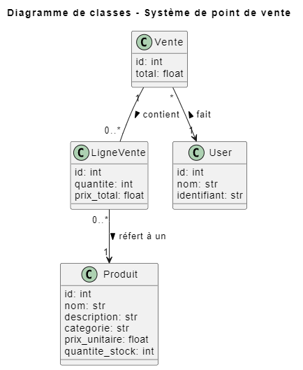
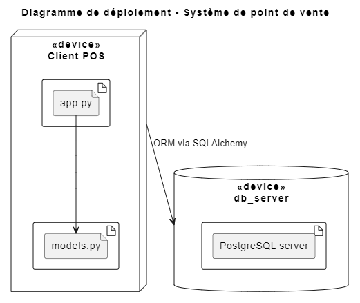

## LOG430-Lab2

# Architecture de l'application 



# Deploiement de l'application


# Lancer le projet 
1. Se placer sur le root directory
```
cd src 
python app.py
```

# Lancer le conteneur
1. Se placer sur le root directory et rouler la base de données
```
docker compose up -d db
```
2. Effectuer 3 splits du terminal, et rouler une dans chaque terminal
```
docker compose run --rm --service-ports caisse-1
docker compose run --rm --service-ports caisse-2
docker compose run --rm --service-ports caisse-3
```

